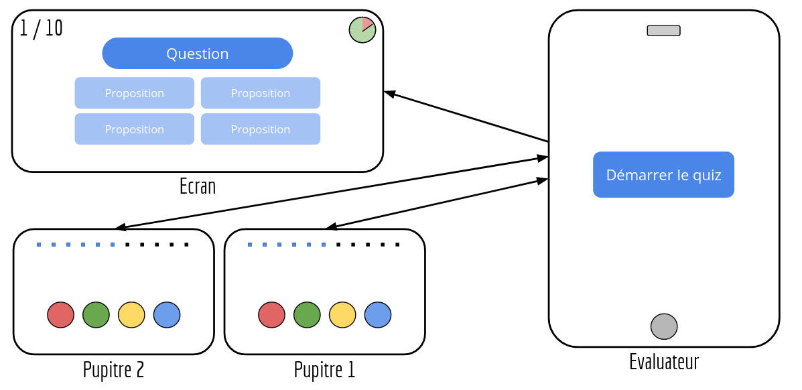
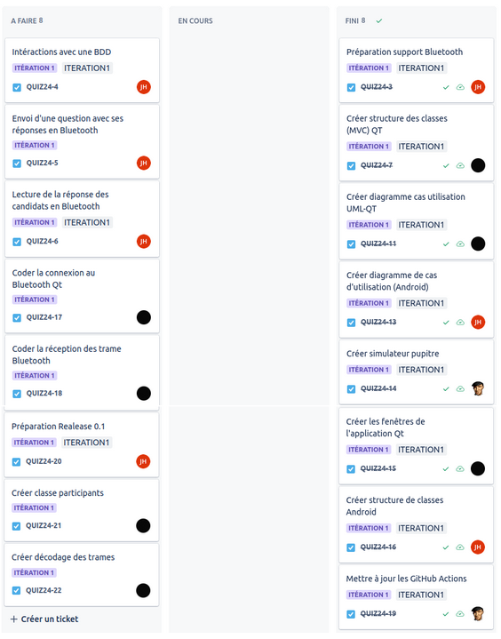
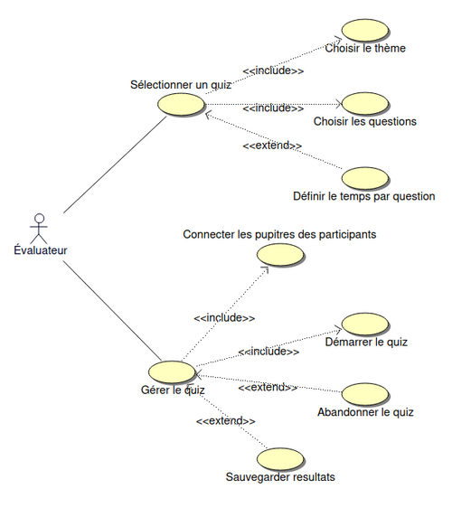
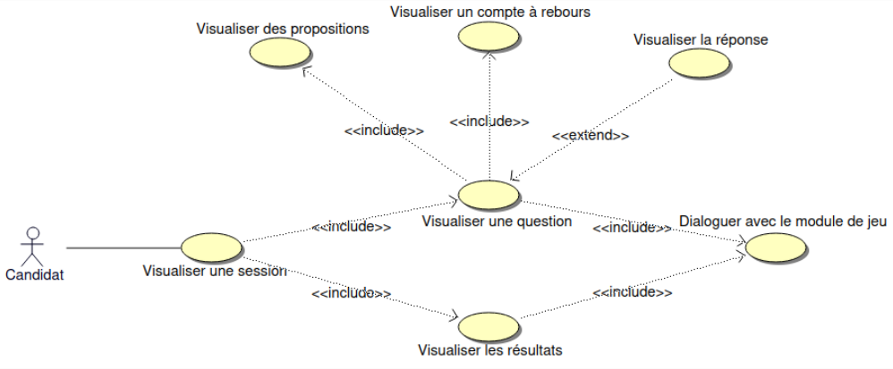
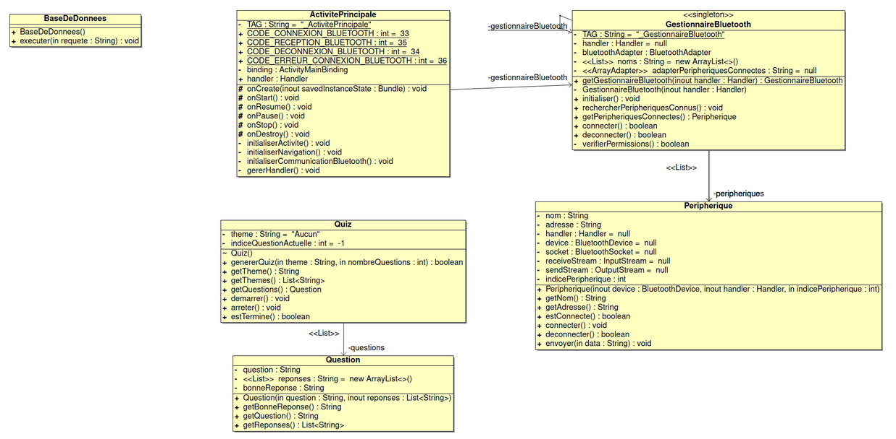
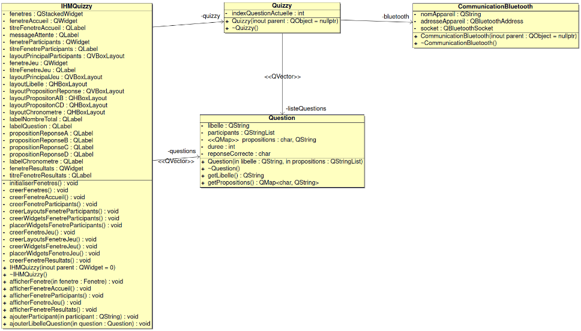
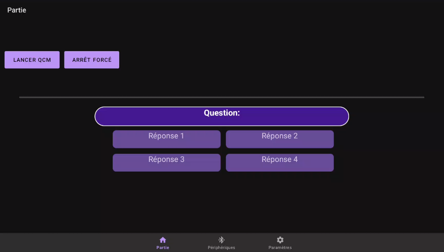
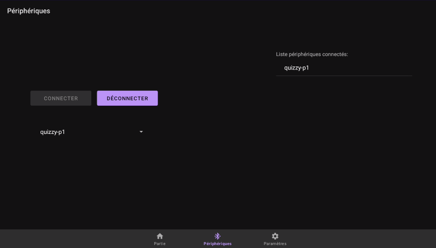
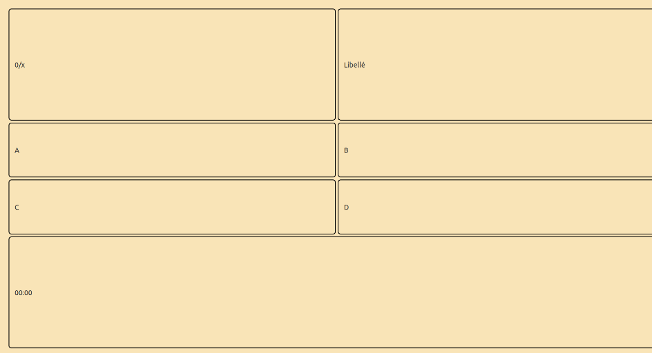
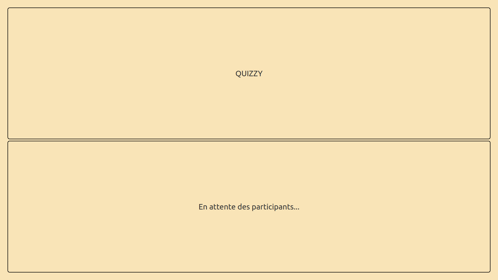

 

  

# Le projet quizzy 2024

- [Le projet quizzy 2024](#le-projet-quizzy-2024)
  - [Informations](#informations)
  - [Présentation](#présentation)
  - [Fonctionnalités](#fonctionnalités)
    - [Android](#android)
    - [Ecran](#ecran)
  - [ Itérations](#itérations)
    - [Itération 1](#itération-1)
    - [ Itération 2](#itération-2)
    - [Itération 3](#itération-3)
  - [Tickets Jira](#tickets-jira)
  - [Documentation du code](#documentation-du-code)
  - [Diagramme de cas d'utilisation](#diagramme-de-cas-dutilisation)
    - [Android](#android-1)
    - [ Qt Creator](#qt-creator)
  - [Diagramme de classes](#diagramme-de-classes)
    - [Android](#android-2)
    - [ Qt Creator](#qt-creator-1)
  - [Protocole](#protocole)
    - [Évaluateur -\> Interface de jeu](#évaluateur---interface-de-jeu)
    - [Évaluateur -\> Pupitre](#évaluateur---pupitre)
    - [Pupitre -\> Évaluateur](#pupitre---évaluateur)
  - [Screenshots](#screenshots)
    - [Interface Évaluateur (Tablette)](#interface-évaluateur-tablette)
      - [Page de gestion du quiz](#page-de-gestion-du-quiz)
      - [Page d'association des pupitres](#page-dassociation-des-pupitres)
    - [Interface participant (Écran)](#interface-participant-écran)
      - [Vue de déroulement du quiz](#vue-de-déroulement-du-quiz)
      - [Vue d'attente de participants](#vue-dattente-de-participants)
  - [Historique des versions](#historique-des-versions)
    - [Version 0.1](#version-01)
      - [Android](#android-3)
      - [Ecran](#ecran-1)
  - [Recette](#recette)
  - [Auteurs](#auteurs)

---

## Informations

- Nom du logiciel : Quizzy
- Date de début : 15 février 2024
- Numéro de version du logiciel : 0.1

## Présentation

Le système **QUIZZY** permet de "jouer" et de s'évaluer en pleine immersion dans une salle.

- Un écran principal permet de visualiser le quiz en cours avec la question posée et ses propositions de réponse
- Une tablette est associée à l'évaluateur qui peut chosir le quiz à afficher
- Un ou plusieurs pupitres disposant chacun de 4 bumpers permettant de sélectionner la réponse d'un participant. Une rangée de LED affiche le temps restant pour répondre

## Fonctionnalités

### Android

- Se connecter à un périphérique Bluetooth
- Emettre une requête vers un périphérique Bluetooth
- Recevoir une trame

### Ecran

- Afficher disposition des fenêtres

##  Itérations

### Itération 1

- **Envoyer une question** : L’application envoie une question à l’utilisateur.
- **Récupérer les réponses** : L’application récupère les réponses de l’utilisateur.
- **Afficher les questions** : Les questions sont affichées à l’utilisateur.
- **Afficher les propositions** de réponse :Afficher les 4 propositions de réponse.

###  Itération 2

- **Paramétrage partie** : L’utilisateur peut paramétrer sa partie.
- **Avoir des thèmes de questions** : L’utilisateur peut choisir parmi différents thèmes de questions.
- **Gestion de chronomètre** : Un chronomètre est mis en place pour limiter le temps de réponse.
- **Affichage chronomètre** : Le chronomètre est affiché à l’utilisateur.

### Itération 3

- **Afficher statistiques** : Les statistiques de l’utilisateur sont affichées.
- **Sauvegarde statistiques** : Les statistiques de l’utilisateur sont sauvegardées pour une utilisation future.

## Tickets Jira

## Documentation du code

https://btssn-lasalle-84.github.io/quizzy-2024/

## Diagramme de cas d'utilisation

### Android

###  Qt Creator

## Diagramme de classes

### Android

###  Qt Creator

## Protocole

### Évaluateur -> Interface de jeu

| Type | Format | Description | Exemple |
|------|--------|-------------|---------|
| Lancer un quiz| `$L\n`| Signaler le début d’un quiz| `$L\n` |
| Indiquer un participant au quiz | `$I;PID;NOM DU JOUEUR\n` | PID: string (l’identifiant du pupitre)   NOM (ou pseudo) DU JOUEUR: string | `$I;P1;Robert\n` Joueur ‘Robert’ avec UID ‘4615’ |
| Envoyer une question | `$Q;LIBELLE;R1;R2;R3;R4;NUMERO_REP_VALIDE;TEMPS\n`| LIBELLE : string (une question)   R1, R2, R3 et R4 : string (propositions)   NUMERO_REP_VALIDE : int (1 à 4)   TEMPS : int (en secondes, si 0 alors la question n’a pas de temps limite) | `$Q;Quelle est le meilleur OS ?;Linux;Windows;Mac;Minitel;4;10\n` La réponse valide est la n°4, le Minitel |
| Signaler le démarrage (top) d’une question | `$T\n`| Afficher le démarrage du chronomètre | `$T\n` |
| Indiquer la réponse choisie par un joueur | `$R;PID_JOUEUR;NUMÉRO_REPONSE;TEMPS_REPONSE\n` | PID_JOUEUR: string   NUMÉRO_REPONSE : 1 à 4   TEMPS_RÉPONSE : en ms | `$R;P1;1;3500\n` Choix réponse n°1 pour joueur du pupitre 1 en 3500 ms |
| Afficher la réponse | `$A\n` | Afficher la réponse à la question actuelle | `$A\n` |
| Passer à la question suivante | `$S\n`| Afficher question suivante| `$S\n` |
| Revenir à la question précédente | `$P\n`| Afficher question précédente| `$P\n` |
| Finir un quiz | `$F\n`| Signaler la fin d’un quiz | `$F\n` |

### Évaluateur -> Pupitre

| Type | Format | Description | Exemple |
|------|--------|-------------|---------|
| Indiquer le numéro de question et le temps alloué pour répondre | `$Q;NUMERO_QUESTION;TEMPS\n`| NUMERO_QUESTION : de 1 à n   TEMPS QUESTION : en secondes si 0 alors la question n’a pas de temps limite | `$Q;1;30\n` Question n°1 30 secondes pour cette question |
| Désactiver buzzers + chronomètre | `$D;NUMERO_QUESTION\n`| Désactiver les buzzers et arrêter le chronomètre si besoin | `$D;1\n` |
| Activer buzzers + lancer chronomètre | `$E;NUMERO_QUESTION\n` | Activer les buzzers pour ce numéro de question et lancer le chronomètre si besoin | `$E;1\n` |

### Pupitre -> Évaluateur

| Type | Format | Description | Exemple |
|------|--------|-------------|---------|
| Envoyer une réponse | `$R;NUMERO_QUESTION;NUMERO_REPONSE;TEMPS_REPONSE\n` | NUMERO_QUESTION : de 1 à n   NUMERO_REPONSE : 1 à 4 (0 = non répondu)   TEMPS_REPONSE : en ms si 0 alors le temps n’a pas été mesuré | `$R;1;2;17000\n` Acquitter toutes les trames de l’évaluateur|
| Acquitter | `$A\n`| Acquitter toutes les trames de l’évaluateur | `$A\n` |

## Screenshots

### Interface Évaluateur (Tablette)

#### Page de gestion du quiz

- Cette page permet de visualiser la partie en cours et de défini son état (En cours | Arrêté)

#### Page d'association des pupitres

- Cette page permet de se connecter aux pupitres et à un ou plusieurs écrans

### Interface participant (Écran)

#### Vue de déroulement du quiz

- Cette vue permet d'afficher le déroulement de la partie (Question, Propositions, Temps restant, Numéro de question)

#### Vue d'attente de participants

- Cette vue permet d'afficher la liste des participants en attente du démarrage du quiz

## Historique des versions

### Version 0.1

#### Android

- Se connecter à un périphérique Bluetooth
- Emettre une requête vers un périphérique Bluetooth
- Recevoir une trame

#### Ecran

- Afficher disposition des fenêtres

## Recette

| Fonctionalités | Oui | Non |
|----------------|-----|-----|
| Connexion Bluetooth (Android) | X |  |
| Communication Bluetooth (Qt) | | X |
| Décodage des trame | | X |
| Envoyer une question | X | |
| Récupérer les réponses | X | |
| Afficher les questions | X | |
| Afficher les propositions | X | |

## Auteurs

- Étudiant IR : HNIZDO Thomas <<thomas.hnizdo@gmail.com>>
- Étudiant IR : HILLION Jules <<juleshillion@gmail.com>>

---
©️ LaSalle Avignon 2024