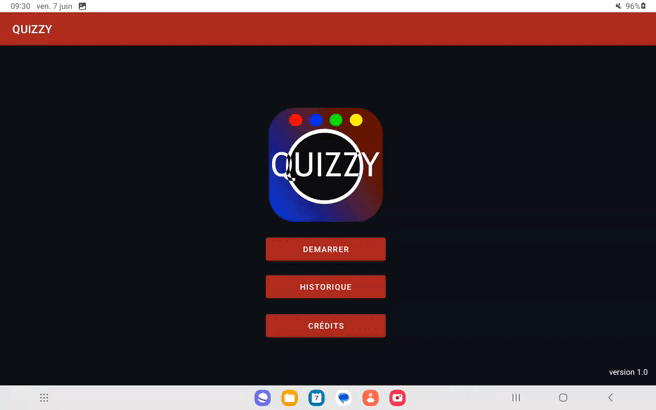
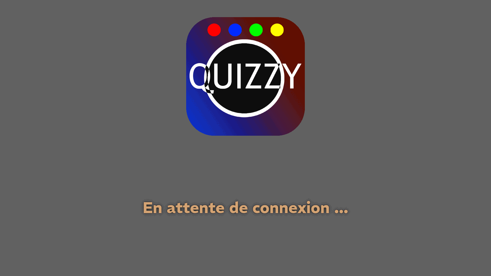
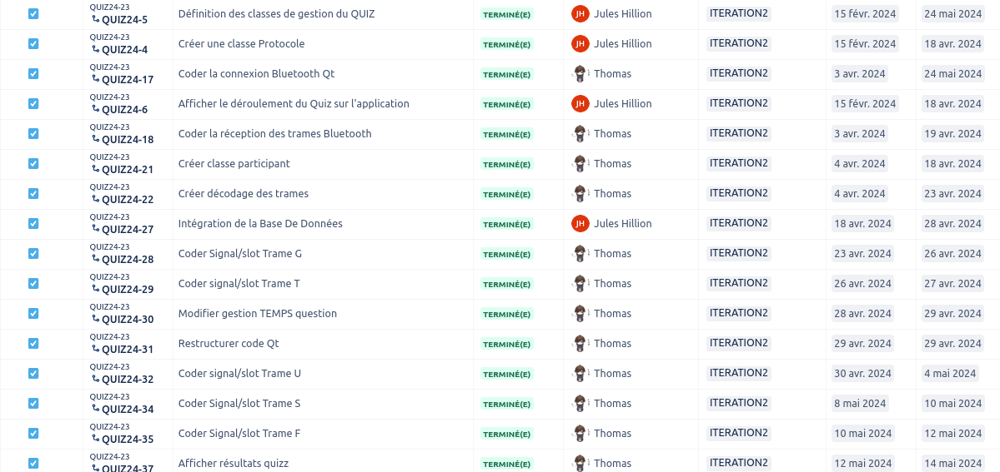
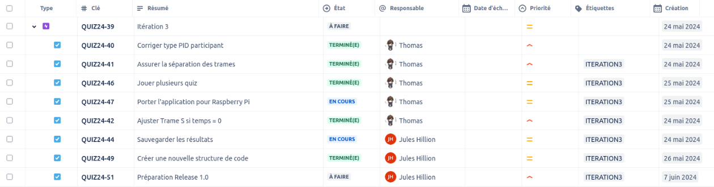
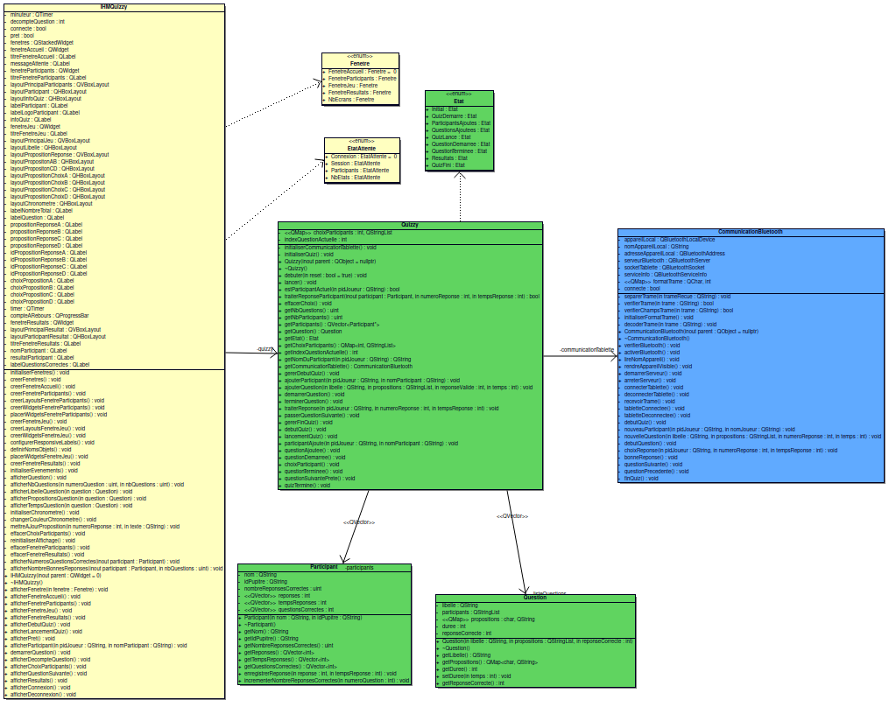
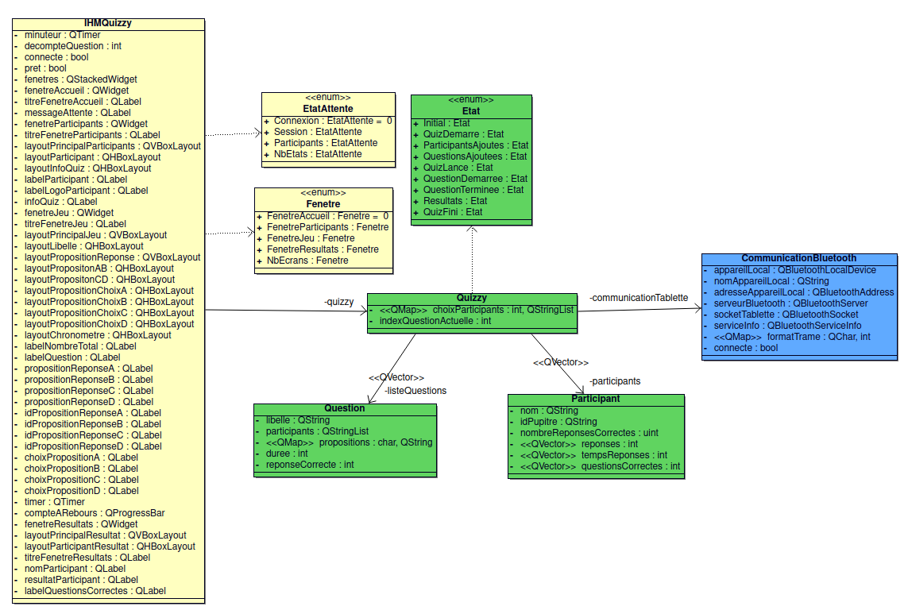
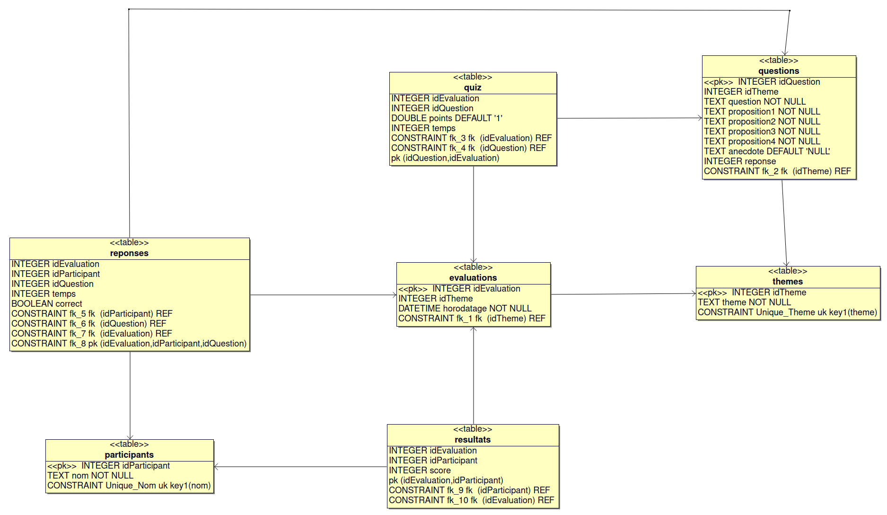

 

[](https://github.com/btssn-lasalle-84/quizzy-2024/actions/workflows/make-qt.yml) [](https://github.com/btssn-lasalle-84/quizzy-2024/actions/workflows/android-build.yml) [](https://github.com/btssn-lasalle-84/quizzy-2024/actions/workflows/pages/pages-build-deployment)

# Le projet QUIZZY 2024 (version 1.0)

- [Le projet QUIZZY 2024 (version 1.0)](#le-projet-quizzy-2024-version-10)
	- [Présentation](#présentation)
	- [Recette](#recette)
	- [Screenshots](#screenshots)
                - [Vidéo](#vidéo)
		- [Interface Évaluateur (Tablette)](#interface-évaluateur-tablette)
		- [Interface participant (Écran)](#interface-participant-écran)
	- [Diaporamas de présentation](#diaporamas-de-présentation)
	- [Itérations](#itérations)
		- [Itération 1](#itération-1)
		- [Itération 2](#itération-2)
		- [Itération 3](#itération-3)
	- [Diagramme de cas d'utilisation](#diagramme-de-cas-dutilisation)
		- [Quizzy-mobile (Java/Android)](#quizzy-mobile-javaandroid)
		- [Quizzy-desktop (C++/Qt)](#quizzy-desktopcqt)
	- [Diagramme de classes](#diagramme-de-classes)
		- [Quizzy-mobile (Java/Android)](#quizzy-mobile-javaandroid-1)
		- [Quizzy-desktop (C++/Qt)](#quizzy-desktopcqt-1)
			- [Diagramme des classes](#diagramme-des-classes)
			- [Diagramme simplifié des classes](#diagramme-simplifié-des-classes)
	- [Base de données](#base-de-données)
	- [Protocole](#protocole)
		- [Évaluateur -\> Interface de jeu](#évaluateur---interface-de-jeu)
		- [Évaluateur -\> Pupitre](#évaluateur---pupitre)
		- [Pupitre -\> Évaluateur](#pupitre---évaluateur)
	- [Historique des versions](#historique-des-versions)
		- [Version 1.0](#version-10)
			- [Tablette](#tablette)
			- [Écran](#écran)
		- [Version 0.2](#version-02)
			- [Tablette](#tablette-1)
			- [Écran](#écran-1)
		- [Version 0.1](#version-01)
			- [Tablette](#tablette-2)
			- [Écran](#écran-2)
	- [Documentation du code](#documentation-du-code)
	- [Auteurs](#auteurs)

---

## Présentation

Le système **QUIZZY** permet de "jouer" et de s'évaluer en pleine immersion dans une salle.

- Une tablette est associée à l'évaluateur qui peut chosir le quiz à afficher
- Un écran principal permet de visualiser le quiz en cours avec la question posée et ses propositions de réponse
- Un ou plusieurs pupitres disposant chacun de 4 _bumpers_ permettant de sélectionner la réponse d'un participant. Une rangée de LED affiche le temps restant pour répondre en mode compte à rebours.


## Recette

- Quizzy-mobile (Java/Android)

| Fonctionalités                          | A faire | En cours | Terminé |
| --------------------------------------- | :-----: | :------: | :-----: |
| Sélectionner un quiz                    |         |          |    X    |
| Gérer le quiz                           |         |          |    X    |
| Connecter les pupitres des participants |         |          |    X    |
| Démarrer / Abandonner le quiz           |         |          |    X    |
| Sauvegarder les résultats               |         |          |    X    |
| Choisir le thème                        |         |          |    X    |
| Définir le temps par question           |         |          |    X    |

- Quizzy-desktop (C++/Qt)

| Fonctionalités                  | A faire | En cours | Terminé |
| ------------------------------- | :-----: | :------: | :-----: |
| Visualiser et gérer une session |         |          |    X    |
| Visualiser une question         |         |          |    X    |
| Visualiser les propositions     |         |          |    X    |
| Visualiser un compte à rebours  |         |          |    X    |
| Visualiser les résultats        |         |          |    X    |
| Dialoguer avec la tablette      |         |          |    X    |

## Screenshots

### Vidéo

[](https://youtu.be/_dPSoN5WaAY)

### Interface Évaluateur (Tablette)



Les différentes vues :

- Accueil (Session, Historique, Crédits)
- Paramétrage d'une session (Thème, Temps, Nombre de question, Participants)
- Association des paticipants, connexions aux pupitres et écrans
- Visualisation et gestion d'une session
- Historique de partie sauvegardées

Les différentes popups :

*Note :  Les termes entre parenthèses indiquent les boutons permettant d'intéragir avec le popup*

- Aucun participant connecté (Continuer, Configurer, Annuler)
- Participant non connecté (Connecté, Dissocier, Annuler)
- Périphérique non configuré (Déconnecter, Configurer, Annuler)
- Créer un participant (Créer, Annuler)
- Fin de session (Relancer, Sauvegarder, Quitter)
- Historique (Visualiser, Supprimer, Fermer)
- Crédits (Fermer)

### Interface participant (Écran)



Les différentes vues :

- affichage de la liste des participants en attente du démarrage du quiz
- affichage du déroulement de la partie (Question, Propositions, Temps restant, Numéro de question)
- affichage des résultats des participants

## Diaporamas de présentation

- [Oral - HILLION.pptx](diaporamas/Oral%20-%20HILLION.pptx) (Android / Java)
- [Oral - HNIZDO.pptx](diaporamas/Oral%20-%20HNIZDO.pptx) (Qt / C++)

## Itérations

### Itération 1

- **Envoyer une question** : L’application envoie une question à l’utilisateur.
- **Récupérer les réponses** : L’application récupère les réponses de l’utilisateur.
- **Afficher les questions** : Les questions sont affichées à l’utilisateur.
- **Afficher les propositions** de réponse :Afficher les 4 propositions de réponse.


### Itération 2

- **Paramétrage partie** : L’utilisateur peut paramétrer sa partie.
- **Avoir des thèmes de questions** : L’utilisateur peut choisir parmi différents thèmes de questions.
- **Gestion de chronomètre** : Un chronomètre est mis en place pour limiter le temps de réponse.
- **Affichage chronomètre** : Le chronomètre est affiché à l’utilisateur.



### Itération 3

- **Afficher les statistiques** : Les statistiques de l’utilisateur sont affichées.
- **Sauvegarder les statistiques** : Les statistiques de l’utilisateur sont sauvegardées pour une utilisation future.
- **Configurer le mode kiosk** : La configuration de la Raspberry Pi en mode kiosk
- **Effectuer plusieurs quiz** : La possibilité d'enchaîner plusieurs quiz
- **Mettre en forme l'affichage** : La mise en forme pour un grand écran



## Diagramme de cas d'utilisation

### Quizzy-mobile (Java/Android)


### Quizzy-desktop (C++/Qt)


## Diagramme de classes

### Quizzy-mobile (Java/Android)


### Quizzy-desktop (C++/Qt)

#### Diagramme des classes



#### Diagramme simplifié des classes



## Base de données



Détails de la structure :

- `quiz` contient la liste des questions posées durant une session
- `questions` contient la liste des toutes les questions avec ses propositions existantes
- `reponses` contient la liste des bonnes et mauvaises reponses des participants par rapport aux questions de chaque sessions
- `evaluations` contient la liste de toutes les sessions sauvegardées avec leur horodatage
- `themes` contient la liste des themes de questions existantes
- `participants` contient la liste des participants
- `resultats` contient la liste des score de participants par session

Structure de `quizzy.db` :

```sql
CREATE TABLE IF NOT EXISTS "themes" (
	"idTheme"	INTEGER,
	"theme"	TEXT NOT NULL UNIQUE,
	PRIMARY KEY("idTheme" AUTOINCREMENT)
);
CREATE TABLE IF NOT EXISTS "evaluations" (
	"idEvaluation"	INTEGER,
	"idTheme"	INTEGER,
	"horodatage"	DATETIME NOT NULL,
	FOREIGN KEY("idTheme") REFERENCES "themes"("idTheme"),
	PRIMARY KEY("idEvaluation" AUTOINCREMENT)
);
CREATE TABLE IF NOT EXISTS "participants" (
	"idParticipant"	INTEGER,
	"nom"	TEXT NOT NULL UNIQUE,
	PRIMARY KEY("idParticipant" AUTOINCREMENT)
);
CREATE TABLE IF NOT EXISTS "questions" (
	"idQuestion"	INTEGER,
	"idTheme"	INTEGER,
	"question"	TEXT NOT NULL,
	"proposition1"	TEXT NOT NULL,
	"proposition2"	TEXT NOT NULL,
	"proposition3"	TEXT NOT NULL,
	"proposition4"	TEXT NOT NULL,
	"anecdote"	TEXT DEFAULT NULL,
	"reponse"	INTEGER,
	FOREIGN KEY("idTheme") REFERENCES "themes"("idTheme") ON DELETE CASCADE,
	PRIMARY KEY("idQuestion" AUTOINCREMENT)
);
CREATE TABLE IF NOT EXISTS "quiz" (
	"idEvaluation"	INTEGER,
	"idQuestion"	INTEGER,
	"points"	DOUBLE DEFAULT 1,
	"temps"	INTEGER,
	FOREIGN KEY("idEvaluation") REFERENCES "evaluations"("idEvaluation"),
	FOREIGN KEY("idQuestion") REFERENCES "questions"("idQuestion"),
	PRIMARY KEY("idQuestion","idEvaluation")
);
CREATE TABLE IF NOT EXISTS "reponses" (
	"idEvaluation"	INTEGER,
	"idParticipant"	INTEGER,
	"idQuestion"	INTEGER,
	"temps"	INTEGER,
	"correct"	BOOLEAN NOT NULL CHECK("correct" IN (0, 1)),
	FOREIGN KEY("idParticipant") REFERENCES "participants"("idParticipant"),
	FOREIGN KEY("idQuestion") REFERENCES "questions"("idQuestion"),
	FOREIGN KEY("idEvaluation") REFERENCES "evaluations"("idEvaluation"),
	PRIMARY KEY("idEvaluation","idParticipant","idQuestion")
);
CREATE TABLE IF NOT EXISTS "resultats" (
	"idEvaluation"	INTEGER,
	"idParticipant"	INTEGER,
	"score"	INTEGER,
	PRIMARY KEY("idEvaluation","idParticipant"),
	FOREIGN KEY("idParticipant") REFERENCES "participants"("idParticipant"),
	FOREIGN KEY("idEvaluation") REFERENCES "evaluations"("idEvaluation")
);
```

## Protocole

Nom des périphériques Bluetooth :

- \"**quizzy-en**\" où \"**n**\" est le numéro de l'écran.
- \"**quizzy-pn**\" où \"**n**\" est le numéro de pupitre.

### Évaluateur -> Interface de jeu

| Type | Format | Description | Exemple |
|------|--------|-------------|---------|
| Lancer un quiz| `$L\n`| Signaler le début d’un quiz| `$L\n` |
| Indiquer un participant au quiz | `$I;PID;NOM DU JOUEUR\n` | PID: string (l’identifiant du pupitre) <br> NOM (ou pseudo) DU JOUEUR: string | `$I;P1;Robert\n`<br>Joueur ‘Robert’ avec UID ‘4615’ |
| Envoyer une question | `$G;LIBELLE;R1;R2;R3;R4;NUMERO_REP_VALIDE;TEMPS\n`| LIBELLE : string (une question) <br> R1, R2, R3 et R4 : string (propositions) <br> NUMERO_REP_VALIDE : int (1 à 4) <br> TEMPS : int (en secondes, si 0 alors la question n’a pas de temps limite) | `$G;Quelle est le meilleur OS ?;Linux;Windows;Mac;Minitel;4;10\n`<br>La réponse valide est la n°4, le Minitel |
| Signaler le démarrage (top) d’une question | `$T\n`| Afficher le démarrage du chronomètre | `$T\n` |
| Indiquer la réponse choisie par un joueur | `$U;PID_JOUEUR;NUMÉRO_REPONSE;TEMPS_REPONSE\n` | PID_JOUEUR: string <br> NUMÉRO_REPONSE : 1 à 4 <br> TEMPS_RÉPONSE : en ms | `$U;P1;1;3500\n`<br>Choix réponse n°1 pour joueur du pupitre 1 en 3500 ms |
| Afficher la réponse | `$H\n` | Afficher la réponse à la question actuelle | `$H\n` |
| Passer à la question suivante | `$S\n`| Afficher question suivante| `$S\n` |
| Revenir à la question précédente | `$P\n`| Afficher question précédente| `$P\n` |
| Finir un quiz | `$F\n`| Signaler la fin d’un quiz | `$F\n` |

### Évaluateur -> Pupitre

| Type | Format | Description | Exemple |
|------|--------|-------------|---------|
| Indiquer le numéro de question et le temps alloué pour répondre | `$Q;NUMERO_QUESTION;TEMPS\n`| NUMERO_QUESTION : de 1 à n <br> TEMPS QUESTION : en secondes si 0 alors la question n’a pas de temps limite | `$Q;1;30\n`<br>Question n°1<br>30 secondes pour cette question |
| Activer buzzers + lancer chronomètre | `$E;NUMERO_QUESTION\n` | Activer les buzzers pour ce numéro de question et lancer le chronomètre si besoin | `$E;1\n` |
| Désactiver buzzers + chronomètre | `$D;NUMERO_QUESTION\n`| Désactiver les buzzers et arrêter le chronomètre si besoin | `$D;1\n` |
| Indiquer résultat | `$B;NUMERO_QUESTION;RESULTAT\n` | NUMERO_QUESTION : de 1 à n <br> RESULTAT: <br> 1 (vraie) ou 0 (faux) | `$B;1;0\n` |

### Pupitre -> Évaluateur

| Type | Format | Description | Exemple |
|------|--------|-------------|---------|
| Envoyer une réponse | `$R;NUMERO_QUESTION;NUMERO_REPONSE;TEMPS_REPONSE\n` | NUMERO_QUESTION : de 1 à n <br> NUMERO_REPONSE : 1 à 4 (0 = non répondu) <br> TEMPS_REPONSE : en ms si 0 alors le temps n’a pas été mesuré | `$R;1;2;17000\n`<br>Acquitter toutes les trames de l’évaluateur|
| Acquitter | `$A\n`| Acquitter toutes les trames de l’évaluateur | `$A\n` |

## Historique des versions

### Version 1.0

#### Tablette

- Nouvelle IHM
- Se connecter à un périphérique Bluetooth
- Emettre une trame vers un périphérique Bluetooth
- Recevoir une trame
- Décoder une trame
- Afficher le déroulement de la session
- Associer les participants à un profil
- Vérifier en continue les connexions aux périphériques
- Paramétrer un quiz et une session
- Calculer automatiquement le temps alloué pour répondre
- Gérer une session
- Sauvegarder une session
- Afficher l'historique des sessions sauvegardées
- Visualiser une session sauvegardée
- Supprimer une session sauvegardée
- Créer un participant

#### Écran

- Afficher disposition des fenêtres
- Se connecter à un périphérique Bluetooth
- Recevoir une trame
- Décoder une trame
- Afficher la liste des participants
- Afficher les statistiques du quiz
- Afficher le déroulement du quiz

### Version 0.2

#### Tablette

- Se connecter à un périphérique Bluetooth
- Emettre une requête vers un périphérique Bluetooth
- Recevoir une trame
- Décoder une trame
- Gérer les participants
- Choisir un thème de quiz et le nombre de questions
- Gérer un quiz
- Afficher le déroulement du quiz
- Calculer automatiquement le temps alloué pour répondre

#### Écran

- Afficher disposition des fenêtres
- Se connecter à un périphérique Bluetooth
- Recevoir une trame
- Décoder une trame
- Afficher la liste des participants
- Afficher les statistiques du quiz
- Afficher le déroulement du quiz

### Version 0.1

#### Tablette

- Se connecter à un périphérique Bluetooth
- Emettre une requête vers un périphérique Bluetooth
- Recevoir une trame

#### Écran

- Afficher disposition des fenêtres

## Documentation du code

https://btssn-lasalle-84.github.io/quizzy-2024/

## Auteurs

- Étudiant IR : [HNIZDO Thomas](mailto:thomas.hnizdo@gmail.com)
- Étudiant IR : [HILLION Jules](mailto:redisbackhere@gmail.com)

---
©️ LaSalle Avignon 2024
